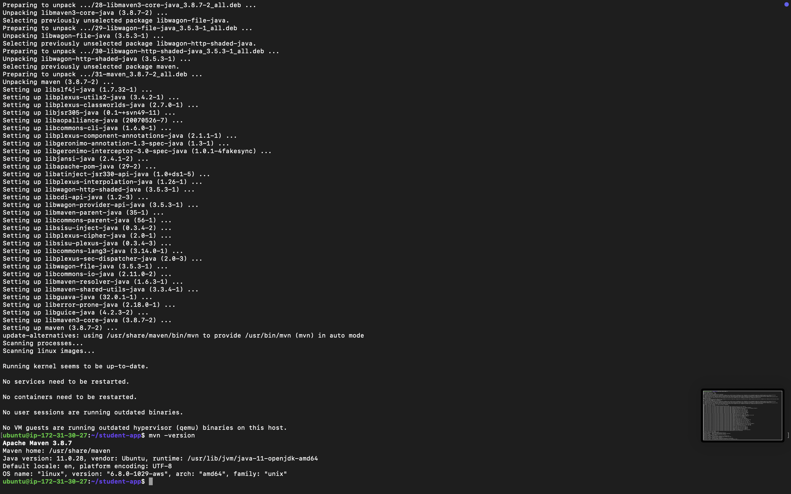

# Student-App Deployment on AWS (Ubuntu + Jenkins + Maven + Git + GitHub)

This project demonstrates how to build and deploy the **Student-App** on an AWS EC2 Ubuntu server using Jenkins, Maven, Git, and GitHub.

---

## Project Overview

Student-App is a web application designed to manage student records efficiently. It allows users to add, update, delete, and view student information through a user-friendly interface

---

## Prerequisites

1. AWS EC2 Ubuntu Instance (t2.micro or higher).
2. Open inbound rules for:
   - SSH (22)
   - HTTP (80)
   - Jenkins (8080) or custom port.
3. GitHub repository containing the `student-app` code.

---

## Steps to Set Up and Deploy

### 1. Update System

``` bash
sudo apt update && sudo apt upgrade -y
```


---

### 2. Install Git

``` bash
# Install Git on your Ubuntu instance
sudo apt install git -y
git --version
```


---

### 3. Clone the GitHub Repository

Make sure you have a GitHub account and create a repository named `student-app`. Then clone it to your EC2 instance.

``` bash
# Replace <your-username> with your GitHub username
git clone <https://github.com/><your-username>/student-app.git
cd student-app
```


---

### 4. Install Java (JDK)

To run Jenkins we need to download java. We will use OpenJDK 11.

``` bash
sudo apt install openjdk-11-jdk -y
java -version
```


---

### 5. Install Maven

Maven is a build automation tool used primarily for Java projects.

``` bash
sudo apt update
sudo apt install maven -y
mvn -version
```




#### 5.1 Creating a project

You need somewhere for your project to reside. Create a directory somewhere and start a shell in that directory. On your command line, execute the following Maven goal:

``` bash
# Replace com.mycompany.app and my-app with your desired groupId and artifactId
# This will create a basic Maven project structure
mvn archetype:generate -DgroupId=com.mycompany.app -DartifactId=my-app -DarchetypeArtifactId=maven-archetype-quickstart -DarchetypeVersion=1.5 -DinteractiveMode=false
```

This will create a new Maven project with the specified groupId and artifactId. The project structure will look like this:

``` plaintext
my-app
├── pom.xml
└── src  
    ├── main
    │   └── java
    │       └── com
    │           └── mycompany
    │               └── app
    │                   └── App.java
    └── test
        └── java
            └── com
                └── mycompany
                    └── app
                        └── AppTest.java

```

You can now open this project in your favorite IDE (like IntelliJ IDEA or Eclipse) and start developing your application.


To view the contents of the file, we need to install the tree command:

``` bash
sudo apt install tree -y
```

---

### 6. Build the Project with Maven

``` bash
mvn clean package
```

---

### 7. Install Jenkins

#### 7.1 Add Jenkins Repository

``` bash
curl -fsSL https://pkg.jenkins.io/debian-stable/jenkins.io-2023.key | sudo tee \
  /usr/share/keyrings/jenkins-keyring.asc > /dev/null
```

#### 7.2 Add Jenkins repository to sources.list

``` bash
echo deb [signed-by=/usr/share/keyrings/jenkins-keyring.asc] https://pkg.jenkins.io/debian-stable binary/ | sudo tee /etc/apt/sources.list.d/jenkins.list > /dev/null
```

#### 7.3 Install Jenkins

``` bash
sudo apt update
sudo apt install jenkins -y
sudo systemctl enable jenkins
sudo systemctl start jenkins
```


Check status:

``` bash
sudo systemctl status jenkins
```

---

### 8. Access Jenkins

- Open browser: `http://<your-ec2-public-ip>:8080`
- Unlock Jenkins:

``` bash
sudo cat /var/lib/jenkins/secrets/initialAdminPassword
```

- Install suggested plugins.
- Create admin user.

---

### 9. Configure GitHub in Jenkins

- Go to **Manage Jenkins → Plugins → Install GitHub Integration Plugin**.
- Add your GitHub repository URL in Jenkins.

---

### 10. Create Jenkins Pipeline

1. Create a new **Freestyle Project** or **Pipeline Project**.
2. Connect to GitHub repo (use HTTPS or SSH).
3. Add build steps:

``` bash
mvn clean package
```

4. Save and build the project.

---

### 11. Deploy Application

After Jenkins builds the WAR file:

``` bash
cd target
```

Example if using Tomcat

``` bash
sudo cp student-app.war /var/lib/tomcat9/webapps/
```

---

## How to Use

1. Access the application at `http://<your-ec2-public-ip>:8080/student-app`.
2. Use the navigation bar to add, edit, or view students.
3. Use the search bar to filter student records.

---

## Notes

- Ensure Java, Maven, Jenkins, and Git are installed properly.
- Use IAM role or SSH key for secure access to AWS.
- Update security groups if app is not accessible.

---

## Tech Stack

- Java
- Spring Boot (if used)
- Maven
- Jenkins
- Git & GitHub
- AWS EC2 (Ubuntu)
- (Add frontend framework if any, e.g., React, Angular)

---

## Screenshots


---

## Contributing

Contributions are welcome! Please open an issue or submit a pull request for any improvements or bug fixes.

## Author

Rushikesh Panchal


